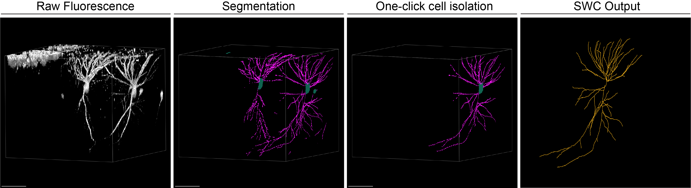

# napari-isolate-cell

[](https://github.com/serg-bg/napari-isolate-cell/raw/main/LICENSE)
[](https://python.org)
[](https://github.com/serg-bg/napari-isolate-cell/actions)
[](https://codecov.io/gh/serg-bg/napari-isolate-cell)
[](https://napari.org/stable/plugins/index.html)

A [napari] plugin to isolate single cell morphologies (e.g., neurons) from label volumes based on a user click, automatically read image scale, and export the isolated structure as TIFF and correctly scaled SWC files.


----------------------------------

## Overview

This plugin helps streamline the process of extracting individual cell structures from dense segmentations, such as those produced by deep learning models like nnUNet.

**Key Features:**

*   **Click-Based Isolation:** Simply click on the soma (or any part) of the cell you want to isolate in a Napari Labels layer.
*   **Automatic Scale Detection:** Reads ZYX scale information directly from TIFF metadata (standard tags or ImageJ metadata) and applies it to the loaded Napari layer.
*   **Anisotropy Awareness:** Automatically populates the widget's Anisotropy fields based on the detected image scale.
*   **Outputs:**
    *   Adds the isolated cell as a new Labels layer in Napari, preserving the original scale.
    *   Saves the isolated label volume as a TIFF file.
    *   Saves the skeletonized structure as an SWC file with coordinates reflecting the original image's physical scale (micrometers).
*   **Configurable Parameters:** Adjust morphological closing radius (defaults to 0 for dense segmentations) and skeleton dust threshold.

## Workflow



## Installation

### For Users (Recommended)
```bash
pip install napari-isolate-cell
```

Or using [uv](https://github.com/astral-sh/uv) (faster):
```bash
uv pip install napari-isolate-cell
```

### For Developers
```bash
git clone https://github.com/serg-bg/napari-isolate-cell.git
cd napari-isolate-cell
pip install -e .[testing]
```

## Usage

1. **Launch napari** and open your 3D segmentation (`.tif` file)
2. **Open plugin**: `Plugins` → `napari-isolate-cell` → `Isolate Cell Arbor`
3. **Select your labels layer** from the dropdown
4. **Click "Activate Click Isolation"**
5. **Click any cell** in the viewer to isolate it

**Outputs:**
- New labels layer with isolated cell
- `isolated_outputs/` folder containing:
  - `.tif` - Isolated cell volume
  - `.swc` - Skeleton with physical coordinates (µm)

**Parameters:**
- **Morphological Closing**: Default 0 (increase to bridge small gaps)
- **Dust Threshold**: Default 100 (minimum skeleton branch size in voxels)
- **Anisotropy**: Auto-detected from TIFF metadata

## Requirements

*   Python >= 3.10
*   napari
*   NumPy
*   scikit-image
*   SciPy
*   tifffile
*   magicgui
*   qtpy

(See `pyproject.toml` for specific version constraints)

## Contributing

Contributions are very welcome. Please file an issue to discuss potential changes or features first. Tests can be run with [pytest] (`pip install -e .[testing]` then `pytest`). Please ensure
the coverage at least stays the same before you submit a pull request.

## License

Distributed under the terms of the [BSD-3] license,
"napari-isolate-cell" is free and open source software

## Issues

If you encounter any problems, please [file an issue] along with a detailed description.

[napari]: https://github.com/napari/napari
[napari hub]: https://napari-hub.org/
[BSD-3]: http://opensource.org/licenses/BSD-3-Clause
[pytest]: https://docs.pytest.org/
[file an issue]: https://github.com/serg-bg/napari-isolate-cell/issues
